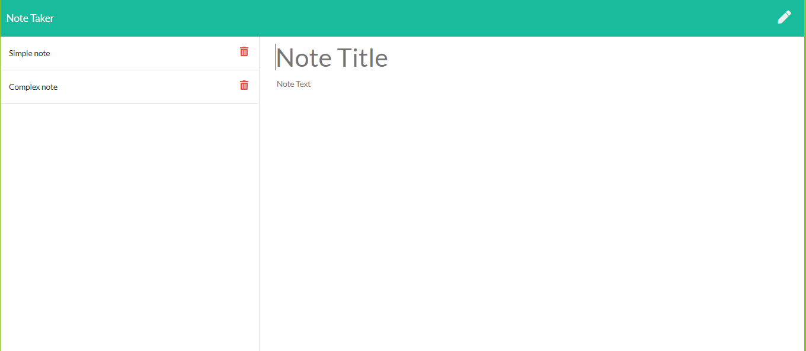

# Good Note Taker  

## Table of Contents  
[Description](#description)  
[Installation](#installation)  
[Usage](#usage)  
[License](#license)  
[Contributors](#contributors)  \
[Visuals](#visuals)  

## Description  
Application that can be used to write, save, and delete notes. 
This application uses an express backend and saves and retrieves note data from a JSON file.
## Installation  
## Usage  
For users that need to keep track of a lot of information, it's easy to forget or be unable to recall something important. Being able to take persistent notes allows users to have written information available when needed.
## License  
## Contributors  
## Visuals
 Link to deployed site:  
 [Note Taker](https://notetaker-mhargett.herokuapp.com/)
